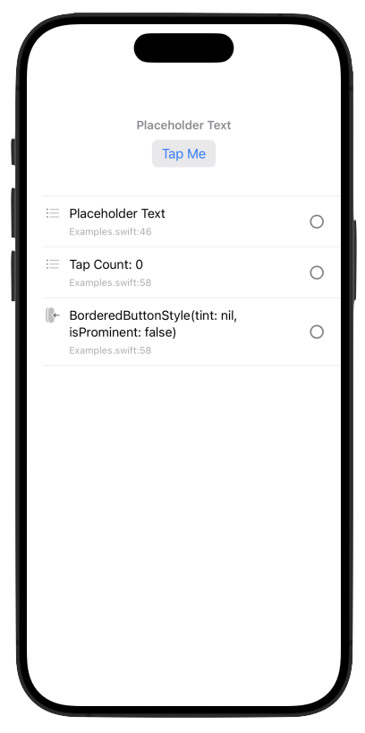

# SwiftUI Property Inspector


[PropertyInspector](https://ipedro.github.io/swiftui-property-inspector/documentation/propertyinspector/propertyinspector) is a SwiftUI component that provides a powerful and flexible way to inspect and interact with properties dynamically. It's designed for developers who want to create sophisticated debugging tools, enhance the interactivity of their apps, or simply need a detailed view into their data structures. All that with minimal code and a [straightforward API](https://ipedro.github.io/swiftui-property-inspector/documentation/propertyinspector/swiftui/view).

## Features

- **Dynamic Property Inspection**: Intuitively inspect properties of any type within your SwiftUI views.
- **Customizable UI**: Easily customize icons, labels, and detail views for each property.
- **Sorting Capability**: Sort properties using custom criteria for better organization and accessibility.
- **Search Functionality**: Quickly find properties with a built-in search feature.
- **Environment Customization**: Adjust corner radius for the property highlight view using environment values.

## Requirements

- iOS 15.0+
- Swift 5.7+
- Xcode 15.0+

## Installation

### Swift Package Manager

Add `swiftui-property-inspector` to your project by including it in your `Package.swift` file:

```swift
dependencies: [
    .package(url: "https://github.com/ipedro/swiftui-property-inspector", .upToNextMajor(from: "1.0.0"))
]
```

Then, import `swiftui-property-inspector` in your SwiftUI views to start using it.

## Documentation

The full documentation for `swiftui-property-inspector` can be found [here](https://ipedro.github.io/swiftui-property-inspector/documentation/propertyinspector/).

## Usage

Here's an example of using `PropertyInspector` in your SwiftUI views:



```swift
import PropertyInspector
import SwiftUI

#Preview(body: {
    PropertyInspector(listStyle: .plain) {
        VStack(content: {
            MyText(content: "Placeholder Text")
            MyButton(style: .bordered)
        })
        .propertyInspectorRowIcon(for: Any.self) { _ in
            Image(systemName: "list.bullet")
        }
        .propertyInspectorRowIcon(for: String.self) { _ in
            Image(systemName: "text.quote")
        }
        .propertyInspectorRowIcon(for: (any PrimitiveButtonStyle).self) { _ in
            Image(systemName: "button.vertical.right.press.fill")
        }
    }
})

struct MyText<S: StringProtocol>: View {
    var content: S

    var body: some View {
        Text(content).inspectProperty(content)
    }
}

struct MyButton<S: PrimitiveButtonStyle>: View {
    var style: S
    @State private var tapCount = 0

    var body: some View {
        Button("Tap Me") {
            tapCount += 1
        }
        .inspectProperty(style, "Tap Count: \(tapCount)")
        .buttonStyle(style)
    }
}

```

### Disabling Inspection

To disable the property inspection:

```swift
var body: some View {
    MyView().propertyInspectorHidden()
}
```

## Contributing

We welcome contributions! If you'd like to contribute, please fork the repository and use a feature branch. Pull requests are warmly welcome.

## License

The `swiftui-property-inspector` package is released under the MIT License. See [LICENSE](LICENSE) for details.
